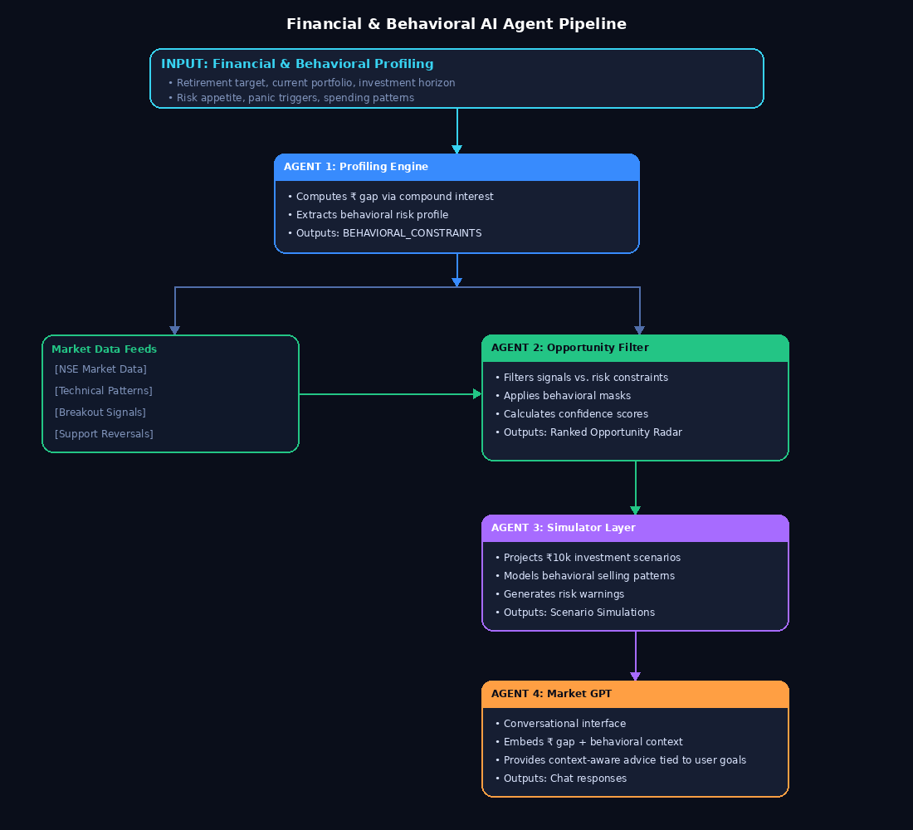
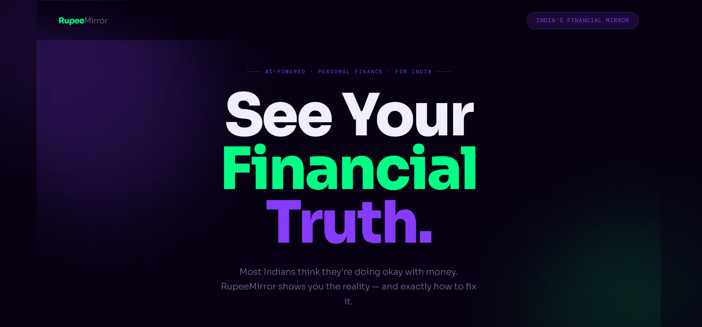
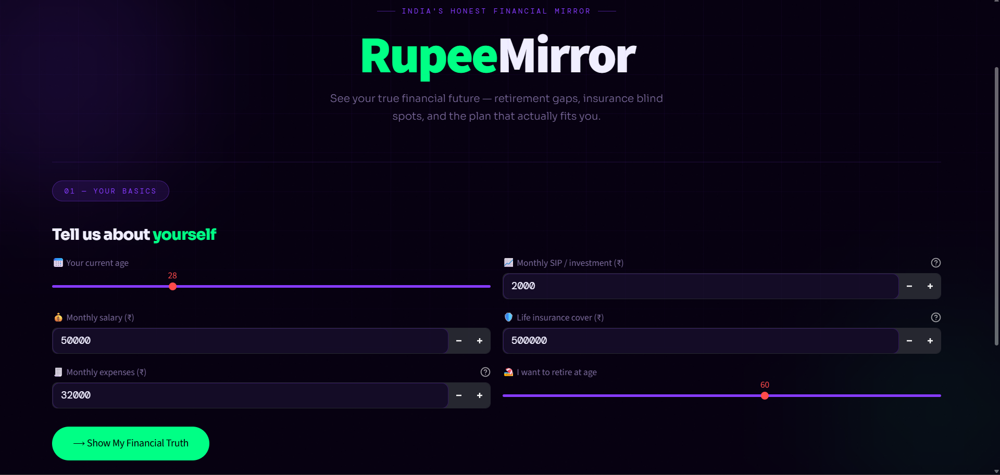
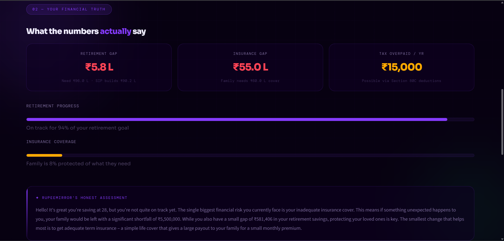
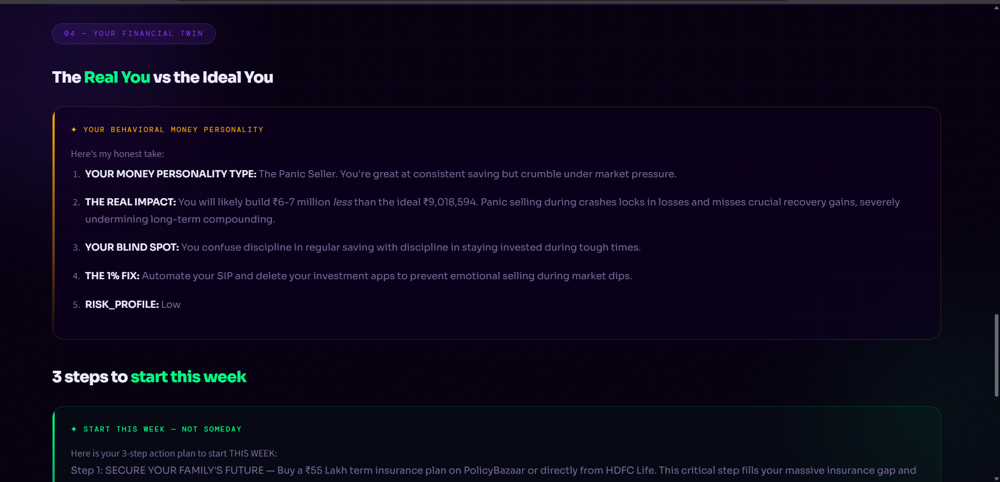

# RupeeMirror: Behavioral AI for the Indian Investor

**ET AI Hackathon 2026 Submission** | **Problem Statement 6: AI for the Indian Investor**

---

## Table of Contents
- [Overview](#overview)
- [Problem Statement](#problem-statement)
- [Solution](#solution)
- [Core Features](#core-features)
- [System Architecture](#system-architecture)
- [Tech Stack](#tech-stack)
- [Installation](#installation)
- [Usage](#usage)
- [Project Impact](#project-impact)
- [Contributing](#contributing)
- [License](#license)

---

## Overview

RupeeMirror is an intelligent investment advisory platform that combines behavioral finance analysis with AI-driven market insights. It addresses the critical gap in retail investor decision-making by integrating psychological profiling with quantitative market analysis, enabling Indian retail investors to make emotionally-aligned, data-driven investment decisions.

**Key Differentiator:** Unlike conventional investment platforms that focus solely on market data or technical patterns, RupeeMirror adapts recommendations based on individual investor psychology and behavioral tendencies.

---

## Problem Statement

### Current Market Challenges
- India has over 140 million demat accounts, with the majority of retail investors making decisions based on tips and emotional reactions
- Retail investors consistently underperform benchmarks due to behavioral factors (panic selling, impulse trading, emotional spending patterns)
- Existing platforms overwhelm users with raw market data without accounting for individual risk tolerance and psychological factors
- Average behavioral gap costs retail investors approximately **2.5% in annual returns** compared to buy-and-hold strategies

---

## Solution

**RupeeMirror** is a psychologically-aware intelligence layer that:

1. **Profiles Investor Behavior:** Assesses financial goals, risk tolerance, and psychological tendencies (panic selling, emotional spending, impulse trading)
2. **Maps Market Signals:** Analyzes National Stock Exchange (NSE) data for technical patterns, breakouts, and support reversals
3. **Aligns Recommendations:** Filters market opportunities against individual risk profiles and behavioral constraints
4. **Provides Contextual Guidance:** Delivers personalized investment advice tied to specific financial goals and behavioral realities

---

## Core Features

### 1. Behavioral Opportunity Radar
- Dynamically filters investment opportunities based on user psychology
- Flags stocks that conflict with behavioral profile (e.g., high-volatility picks for risk-averse investors)
- Provides transparent reasoning for stock inclusion/exclusion
- Displays success rates and confidence metrics for each opportunity

### 2. Chart Pattern Intelligence
- Analyzes real-time technical patterns (breakouts, support reversals, trend confirmations)
- Provides historical success rates with statistical confidence intervals
- Enables informed entry point decisions based on back-tested pattern performance
- Integrates pattern analysis with user-specific risk parameters

### 3. Behavioral Mini-Simulation
- Projects ₹10,000 investment scenarios with Best/Most Likely/Worst-case outcomes
- Predicts behavioral selling triggers at specific price points
- Alerts user to psychological vulnerabilities for each investment
- Example: *"High probability of panic selling at ₹9,600 based on your loss-aversion profile"*

### 4. Portfolio-Aware Market GPT
- Conversational AI agent with knowledge of:
  - User's calculated retirement gap and financial goals
  - Individual behavioral strengths and weaknesses
  - Real-time market data and technical analysis
- Provides contextual investment advice tied to specific financial objectives
- Answers investment questions with consideration of user's emotional and monetary realities

---

## System Architecture

### Multi-Agent Agentic Pipeline



### Agent Roles

**Agent 1: The Profiling Engine**
- Computes compound interest, retirement gap, and financial targets
- Extracts behavioral inputs (risk appetite, panic triggers, spending patterns)
- Outputs: Risk profile with behavioral constraints

**Agent 2: The Opportunity Filter**
- Filters NSE signals (breakouts, support reversals) from market data
- Removes stocks that conflict with user's psychological profile
- Returns: Ranked investment opportunities with confidence metrics

**Agent 3: The Simulator Layer**
- Models ₹10,000 investment scenarios (Best/Most Likely/Worst cases)
- Predicts behavioral selling triggers based on volatility and user psychology
- Outputs: Investment projections with behavioral warning flags

**Agent 4: Portfolio-Aware Market GPT**
- Conversational interface with embedded user context
- Provides investment advice aligned with financial goals and behavioral tendencies
- Ensures SEBI compliance (educational focus, no definitive stock recommendations)

---

## Tech Stack

| Component | Technology |
|-----------|------------|
| **Frontend & UI** | Python, Streamlit |
| **Styling** | Custom CSS (Glassmorphism, High-end Neo-Brutalism, dark theme) |
| **AI / LLM** | Google Gemini API (Generative AI with custom system prompts) |
| **Logic & Simulation** | Python-native financial mathematics, dynamic risk-filtering algorithms |
| **Data Engine** | Python with regex-based pattern matching and financial modeling |

### Dependencies
```
streamlit>=1.55.0
google-generativeai>=0.8.6
```

---

## Installation

### Prerequisites
- Python 3.8 or higher
- pip package manager
- Git (optional, for cloning)

### Setup Steps

**1. Clone or Navigate to Repository**
```bash
git clone <repository-url>
cd rupeemirror
```

**2. Create Virtual Environment**
```bash
# Windows
python -m venv .venv
.venv\Scripts\activate

# macOS/Linux
python3 -m venv .venv
source .venv/bin/activate
```

**3. Install Dependencies**
```bash
pip install -r requirements.txt
```

**4. Configure API Credentials**
Create `.streamlit/secrets.toml` in the project root:
```toml
GEMINI_API_KEY = "your-gemini-api-key-here"
```

Alternatively, set environment variable:
```bash
# Windows (PowerShell)
$env:GEMINI_API_KEY = "your-gemini-api-key-here"

# macOS/Linux
export GEMINI_API_KEY="your-gemini-api-key-here"
```

**⚠️ Security Note:** Never commit API keys to version control. Add `.streamlit/secrets.toml` and `.env` to `.gitignore`.

**5. Launch Application**
```bash
streamlit run app.py
```

The application will open at `http://localhost:8501`

---

## Usage

### User Workflow

1. **Behavioral Profiling**
   - Answer questions about financial goals (retirement target, current savings)
   - Respond to psychological assessment (risk tolerance, spending habits, loss aversion)
   - The system generates your behavioral profile

2. **View Opportunity Radar**
   - Interactive dashboard displays:
     - Filtered stock opportunities (matched to your psychology)
     - Historical success rates for technical patterns
     - Confidence intervals and volatility metrics
     - Explicit "Why Not" reasoning for filtered stocks

3. **Investment Simulation**
   - Review ₹10,000 scenario projections for selected stocks
   - Observe behavioral warning triggers
   - Understand potential emotional selling points

4. **Ask Market GPT**
   - Conversational AI answers investment questions
   - Recommendations account for your retirement gap and psychological profile
   - Educational focus on decision rationale (not definitive advice)

---

## Screenshots

### 1. Hero Section - Your Financial Truth
Welcome screen introducing RupeeMirror as "India's Honest Financial Mirror" with AI-powered personal finance insights.



### 2. Behavioral Profiling - Tell Us About Yourself
Interactive form to capture financial metrics and investment preferences:
- Current age
- Monthly salary and expenses  
- Monthly SIP/Investment amount
- Life insurance coverage
- Retirement target age



### 3. Financial Analysis - What the Numbers Actually Say
Real-time dashboard displaying key financial insights:
- **Retirement Gap:** Shortfall in retirement savings
- **Insurance Gap:** Life insurance coverage adequacy
- **Tax Overpaid:** Potential tax optimization opportunities
- **Retirement Progress:** Visual progress towards goals
- **Insurance Coverage:** Family protection status
- **RupeeMirror's Assessment:** Personalized behavioral insights



### 4. Behavioral Twin Profile - The Real You vs Ideal You
Detailed behavioral assessment showing your money personality and psychological triggers:
- **Your Money Personality:** Personalized profile (e.g., "The Panic Seller")
- **Real Impact:** Quantified cost of behavioral tendencies in rupees
- **Blind Spots:** Psychological vulnerabilities that hinder wealth building
- **The 1% Fix:** Actionable recommendations to overcome behavioral gaps
- **Action Plan:** 3-step weekly strategy aligned with your goals


6. Market GPT - Conversational Investment Advisor
AI chat interface for personalized investment questions:
- Ask about stocks, investment strategies, or retirement planning
- Responses consider your financial goals and behavioral profile
- Educational guidance aligned with SEBI compliance


---

## Project Impact

### Quantified Benefits (Scale: 1 Million Daily Active Investors, 12-Month Period)

| Impact Category | Metric | Annual Value |
|-----------------|--------|--------------|
| **Wealth Protected** | Prevention of behavioral slippage (~1.25% annual loss prevention on ₹150k avg portfolio) | ₹187.5 Crores |
| **Alpha Capture** | Successfully executed 5% swing trades via breakout signals | ₹100 Crores |
| **Time Saved** | Research consolidation (2 hrs/week reduced to 15 min/week) | 91 Million hours |

### Behavioral Impact
- Reduction in panic selling events
- Improved portfolio alignment with personal risk tolerance
- Enhanced decision confidence through transparent reasoning
- Better adherence to long-term investment strategies

---

## Architecture & Compliance

### Error Handling & Guardrails
- **Behavioral Fallbacks:** Regex-based parsing with Python exception handling ensures fallback to baseline profile if LLM parsing fails
- **Financial Compliance:** System prompts enforce SEBI guidelines; output restricted to educational simulations and pattern intelligence (no definitive stock recommendations)
- **Data Privacy:** API keys managed via environment variables; no credentials hardcoded in source code

---

## Contributing

Contributions are welcome. Please:

1. Fork the repository
2. Create a feature branch (`git checkout -b feature/description`)
3. Commit changes with clear messages
4. Submit a pull request with documentation

---

## License

This project is submitted for ET AI Hackathon 2026. Rights and licensing terms should be established per hackathon guidelines.

---

## Contact & Attribution

**Project:** RupeeMirror  
**Hackathon:** ET AI Hackathon 2026  
**Problem Statement:** PS6 - AI for the Indian Investor  

---

## Disclaimer

**Educational Use Only:** RupeeMirror provides investment education and analysis tools. It is not a substitute for professional financial advice. Always consult with qualified financial advisors before making investment decisions. Past performance does not guarantee future results. All investments carry risk, including potential loss of principal.
